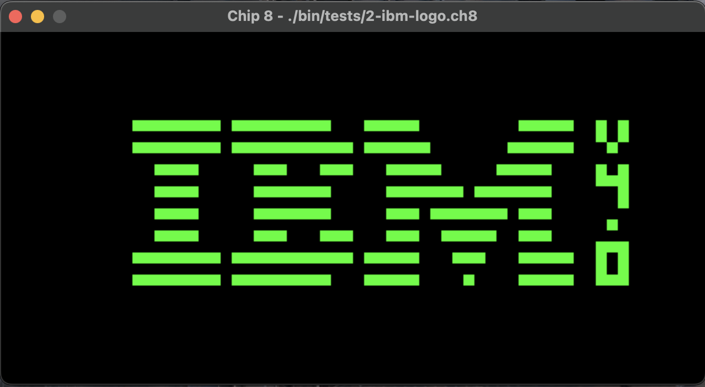
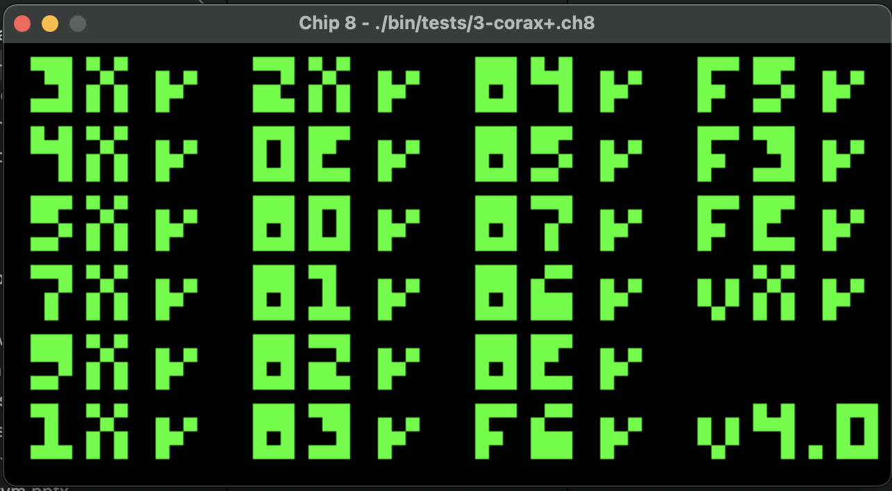

# CHIP-8 Emulator


#### Practice to learn about emulation basics using Go
Contains test and playalbe ROMs in `bin` directory


All opcodes are implemented


#### Note: Running requires `go-sdl2` so please check instalition [here](https://github.com/veandco/go-sdl2)

## Running
Is simple just pass the path to the ROM file
```
go run main.go roms/filter.ch8
```

## Key Bindings

```
Chip8 keypad         Keyboard mapping
1 | 2 | 3 | C        1 | 2 | 3 | 4
4 | 5 | 6 | D   =>   Q | W | E | R
7 | 8 | 9 | E   =>   A | S | D | F
A | 0 | B | F        Z | X | C | V
```
